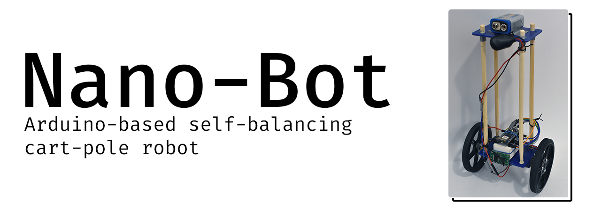

This is the project repository for an Arduino-Nano-based self-balancing cart-pole robot.
Multiple versions of the bot exist for different Nano boards, as well as for PID and ANN (neuro)control.

## Overview

There are two versions of the Nano-Bot sketch that each correspond to different Arduino Nano boards.
- NB_Nano: designed for the original [Arduino Nano](https://docs.arduino.cc/hardware/nano).
- NB_Nano33: designed for the newer [Arduino Nano 33 IOT](https://docs.arduino.cc/hardware/nano-33-iot) to be uploaded and tuned via the <ins>Arduino IDE</ins>.
- NB_NanoIOT: designed for the newer [Arduino Nano 33 IOT](https://docs.arduino.cc/hardware/nano-33-iot) to be uploaded and tuned via <ins>Arduino Cloud</ins> and the <ins>Arduino Web Editor</ins>.
- NB_NEAT: a neurocontrol implementation that uses a [NEAT](https://neat-python.readthedocs.io/en/latest/)-trained artificial neural network for motor control (built on top of NB_Nano33).

## Hardware

All versions of the Nano-Bot require the following components. The exact parts used for my own implementation are also listed, but they can be replaced with equivalent components:
- 2x Wheels - [Part](https://www.pololu.com/product/3690)
- 2x Gearmotors - [Part](https://www.pololu.com/product/3039)
- 1x Motor controller - [Part](https://www.pololu.com/product/1110)
- (At least 1x) Wheel encoder - [Part](https://www.pololu.com/product/3081)

The bot also requires a platform for mounting the above components and creating the cart-pole system.
[This STL](https://www.thingiverse.com/thing:83091/files) may provide a starting point.

### Arduino Nano
In addition to the above components, the implemention of Nano-Bot on an original Arduino Nano requires the following hardware peripheral:
- 6-degree-of-freedom inertial measuring unit (6DOF IMU) - [Part](https://www.pololu.com/product/2736)

The connection schematic is as follows:

### Arduino Nano 33 IOT
The Arduino Nano 33 IOT contains a built-in 6DOF IMU, so an external IMU is unnecessary.

The connection schematic is as follows:

## Software

All versions of the Nano-Bot require the following Arduino libraries:
- PID library - [Link](https://github.com/br3ttb/Arduino-PID-Library/)
- 6DOF IMU - [Link](https://github.com/arduino-libraries/Arduino_LSM6DS3)
- Averaging filter - [Link](https://github.com/kbowerma/arduino/blob/master/libraries/Average/Average.h)

The older Arduino Nano board also requires the Qik motor controller library:
- Qik Motor controller - [Link](https://github.com/pololu/qik-arduino)

The newer Arduino Nano boards (33 IOT, BLE) use SAMD21 CPUs instead of the ATmega328 on the older Nano boards.
Therefore, the newer boards are incompatible with the SoftwareSerial library that is found in the Qik motor controller library.
As a result, the RX and TX pins on the motor controller are connected to pins 0 and 1 on the Arduino Nano 33 IOT to use the board's hardware serial.
Note: the newer boards still use the motor controller, but commands are sent through the hardware serial directly instead of using the Qik library.

## Getting started

The system and its variables are shown in the figure below:
![./img/cartpole.png|width=400px]

### Sensor + Motor Calibration
First, calibrate the IMU to estimate the pole angle. The pole angle will be the state that is fed back to the PID controller for motor control.
For calibration, run sensor_test.ino and tilt the bot along various axes to determine which axes are needed to estimate the angle.
Depending on the physical orientation of the IMU, the inputs to the arctan function and the angle estimation will differ.
Also, the averaging filter may be necessary depending on how noisy the IMU readings and subsequent angle estimations are.

Next, ensure that the motors are fully functional and spin together in the expected directions at various speeds.

### PID Control
Depending on your board, verify and upload one of the NB_Nano sketches and make the necessary adjustments to the angle estimation and motor controls to fit the conventions and setup of your particular system. Once angle estimation is somewhat accurate and rapid, and the motors have been confirmed to be functional, it is time to tune to PID controller.
Adjust the parameters of Kp, Ki, and Kd (if angle estimation has low noise). This process may take a while. Also, tuning your board while it is powered through a USB cable will likely result in a loss of performance when the cable is unplugged (depending on the cable's stiffness), because the cable can dampen the bot's movement, making it deceptively easier to tune. To get around this issue, load sketches via USB and then disconnect the cable and power the board through an external battery. This issue was one of the motivators for switching to the newer boards that support over-the-air sketch uploading via Arduino Cloud.
